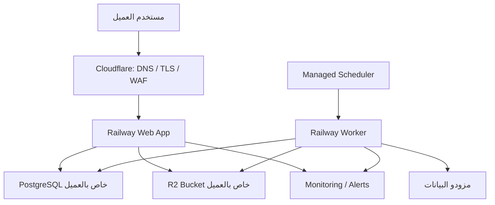

# AdSniper — متطلبات الخدمات والبنية التقنية

- **الإصدار:** 1.0
- **التاريخ:** 2026-09-03
- **النطاق:** الخدمات السحابية والتشغيلية الخارجية اللازمة لتشغيل AdSniper كمنتج SaaS يُباع للشركات
- **يرتبط بـ:** [`SAAS_FOUNDATION_READINESS_AR.md`](SAAS_FOUNDATION_READINESS_AR.md)

---

## 1. الغرض من الوثيقة

تحدد هذه الوثيقة الخدمات التقنية التي يجب توفيرها خارج كود AdSniper: الاستضافة،
قاعدة البيانات، تخزين الوسائط، المهام الخلفية، الهوية، البريد، النسخ الاحتياطي،
المراقبة، الحماية، CI/CD ومزودي البيانات.

الهدف هو منع اعتبار التطبيق جاهزاً للإنتاج لمجرد نجاح البناء أو توفر واجهة تعمل.
كل خدمة إلزامية يجب أن تكون **مفعلة، معزولة، مراقبة، مختبرة، موثقة ولها مالك
تشغيلي** قبل إدخال بيانات عميل خارجي.

---

## 2. القرار التنفيذي

تعتمد المنصة نموذج **Single-tenant Managed SaaS**: لكل عميل نسخة تطبيق، قاعدة
بيانات، تخزين وسائط، أسرار ونطاق وصول مستقل. يبقى الكود والإصدار التشغيلي موحداً
وتديرهما الجهة الموردة.

يوجد مساران معتمدان للنشر:

1. **Controlled Pilot:** Railway + Railway PostgreSQL + Cloudflare R2، عندما لا
   يشترط العميل بقاء البيانات داخل المملكة.
2. **KSA-regulated deployment:** Google Cloud Dammam، عندما ينص العقد أو تصنيف
   البيانات أو سياسة العميل على الاستضافة داخل السعودية.

لا تُبنى البنيتان بالتوازي قبل معرفة متطلبات أول عميل. لكن لا يجوز استخدام
Railway/R2 لعميل يشترط إقامة البيانات في السعودية؛ Railway لا يعلن منطقة سعودية،
وR2 لا يعلن KSA jurisdiction. في هذه الحالة تصبح البنية السعودية شرطاً تعاقدياً
قبل التشغيل.

---

## 3. الحالة الحالية المؤكدة

| المكون | الحالة الحالية | المطلوب |
|---|---|---|
| تطبيق Next.js | نسخة Preview تعمل على Railway | تخصيص App service مستقل لكل عميل وإضافة Staging |
| PostgreSQL | Railway Postgres موجود للـPreview | قاعدة مستقلة، backup، restore drill وقياس RPO/RTO |
| المهام المجدولة | `node-cron` داخل عملية التطبيق | Worker مستقل مع lock، retry، recovery وسجل تشغيل دائم |
| تخزين الوسائط | مسار S3-compatible مثبت على MinIO؛ R2 الحي غير مفعّل | Bucket خاص ومغلق لكل عميل مع token محدود واختبار redeploy |
| مصدر الإعلانات | Adapters موجودة؛ الاختبار الحي المدفوع غير مكتمل | Apify ممول، حدود تكلفة واختبار تغطية حي |
| تسجيل الدخول | بريد allowlist + Passcode مشترك | حساب فردي لكل مستخدم، إلغاء الـPasscode، rate limiting وجلسات آمنة |
| البريد | Resend غير مفعّل | Domain موثق ورسائل الدخول والدعوات والتقارير |
| مراقبة الأخطاء والتوفر | غير موجودة خارجياً | Error tracking، uptime، alerts وon-call owner |
| CI/CD | لا يوجد pipeline إلزامي | GitHub Actions مع فحوصات تمنع الدمج والنشر عند الفشل |
| الذكاء الاصطناعي | اختياري؛ يوجد fallback حتمي | مفتاح منفصل وحدود تكلفة إذا فُعّل |

---

## 4. البنية المستهدفة للـPilot

### قاعدة العزل

لا يشارك عميلان في أي من الآتي:

- App/Worker production environment.
- قاعدة البيانات أو مستخدم قاعدة البيانات.
- Bucket أو token تخزين الوسائط.
- مفاتيح الجلب وحدود التكلفة عند الحاجة التعاقدية.
- أسرار المصادقة والتشفير.
- النطاق الفرعي والسجلات التشغيلية التي تحتوي معرف العميل.

---

## 5. سجل الخدمات المطلوبة

### 5.1 خدمات P0 — قبل أي Pilot خارجي

| ID | الخدمة | الاختيار للـPilot | الغرض | معيار القبول |
|---|---|---|---|---|
| TSV-01 | DNS وTLS وWAF | Cloudflare | نطاق آمن، شهادة TLS، حماية الحافة وrate limiting | HTTPS إجباري، HSTS، WAF مفعّل، واختبار rate limit ناجح |
| TSV-02 | استضافة تطبيق الويب | Railway Pro | تشغيل Next.js والـAPI وPDF | App مستقل، healthcheck، restart policy، limits وتنبيه تعطل |
| TSV-03 | Worker مستقل | Railway service منفصل | الجلب، أرشفة الوسائط والتقارير بعيداً عن طلبات المستخدم | restart لا يفقد المهمة؛ manual+scheduled لا يكرران التشغيل |
| TSV-04 | Scheduler دائم | Railway Cron أو trigger خارجي مراقب | تشغيل المهام في مواعيدها حتى بعد redeploy | كل trigger يحمل run ID؛ missed trigger يولد alert؛ timezone مثبت |
| TSV-05 | قاعدة بيانات | Railway PostgreSQL مستقل | بيانات العميل والتشغيل والتقارير | اتصال خاص، أقل صلاحية، migrations آمنة، monitoring وbackup |
| TSV-06 | تخزين الوسائط | Cloudflare R2 Bucket مستقل | الصور والفيديو وملفات الأرشيف | Public access مغلق؛ bucket-scoped token؛ write/read/delete وredeploy test |
| TSV-07 | نسخ قاعدة البيانات | Railway backup + نسخة مستقلة مشفرة | استعادة بيانات العميل بعد الحذف أو العطل | جدول يومي/أسبوعي/شهري، تنبيه فشل، وrestore drill موثق |
| TSV-08 | مزود بيانات الإعلانات | Apify ومصادر معتمدة | جلب البيانات الحية | Token ممول، سقف تكلفة، retry/backoff، capability contract واختبار سوق حي |
| TSV-09 | بريد تشغيلي | Resend بدومين موثق | روابط الدخول والدعوات والتقارير والتنبيهات | SPF/DKIM/DMARC، منع spoofing، اختبار تسليم وفشل واضح |
| TSV-10 | حسابات المستخدمين | Auth.js مؤقتاً بحساب فردي | هوية قابلة للإلغاء وصلاحيات Viewer/Admin | لا shared credential؛ session revoke؛ rate limit؛ authorization tests |
| TSV-11 | تتبع الأخطاء | Sentry | جمع الاستثناءات وربطها بالإصدار والعملية | بيئة وإصدار وrequest/job correlation مع إخفاء الأسرار |
| TSV-12 | مراقبة التوفر | Better Stack أو بديل معتمد | فحص المنصة من خارج مزود الاستضافة | فحص دوري، escalation وتنبيه فعلي مجرب |
| TSV-13 | إدارة الأسرار | Railway Variables للـPilot | حماية مفاتيح DB/R2/Apify/Auth/Email/AI | لا أسرار في Git أو logs؛ فصل بيئات؛ rotation runbook |
| TSV-14 | CI/CD | GitHub Actions | فحص كل تغيير قبل الدمج والنشر | install، typecheck، lint، tests، build، migration، SCA وsecret scan |
| TSV-15 | سجل تشغيل ومراقبة الجلب | Structured logs + dashboard | معرفة نجاح وفشل وتغطية كل run | run/provider/instance IDs، freshness alerts، retention وصلاحيات وصول |

### 5.2 خدمات P1 — قبل الإطلاق العام GA

| ID | الخدمة | الاختيار المقترح | الغرض | معيار القبول |
|---|---|---|---|---|
| TSV-16 | SSO وMFA | WorkOS أو Auth0 بعد مراجعة الخصوصية | دخول مؤسسي وربط IdP العميل | OIDC/SAML مثبت، MFA للإدارة، تعطيل المستخدم يوقف الوصول |
| TSV-17 | تحليلات استخدام المنتج | PostHog أو بديل privacy-approved | قياس التبني والقيمة دون تخمين | events محددة، لا محتوى حساس، opt-out/retention موثق |
| TSV-18 | دعم العملاء | Zendesk/HubSpot أو نظام معتمد | تذاكر، SLA وتصعيد | owner، severity، response targets وسجل مراسلات |
| TSV-19 | Status Page | Better Stack Status أو بديل | إبلاغ العملاء بالأعطال والصيانة | قوالب incident، سجل زمني، وربط بالتنبيهات |
| TSV-20 | إدارة الخطط والتراخيص | داخل AdSniper + سجل تعاقدي | users/brands/polling/retention/exports/support | enforcement server-side، audit، grace period وتجديد |
| TSV-21 | إدارة أسطول النسخ | Control plane أو inventory مؤتمت | معرفة نسخة وصحة وتكلفة كل عميل | version، migrations، backup، heartbeat، provider وlicense state |
| TSV-22 | إدارة مركزية للأسرار | Cloud Secret Manager أو خدمة مستقلة | rotation وaccess audit على نطاق الأسطول | RBAC، versioning، rotation، break-glass وتنبيه وصول |

### 5.3 خدمات اختيارية

| الخدمة | القرار |
|---|---|
| Anthropic API | اختياري لصياغة التقرير؛ الـfallback الحالي يبقى إلزامياً |
| بوابة دفع إلكترونية | ليست مطلوبة في مرحلة العقود السنوية والفواتير B2B |
| Redis/Queue منفصلة | لا تُضاف للـPilot ما دام PostgreSQL يحقق lock/job ledger/retry؛ تضاف عند إثبات الحاجة |
| Data warehouse | مؤجل حتى يصبح حجم التحليلات أو عدد النسخ مبرراً له |
| Kubernetes | غير مبرر للـPilot؛ يزيد العبء التشغيلي دون قيمة مباشرة للعميل |

---

## 6. متطلبات كل خدمة رئيسية

### 6.1 الاستضافة

- Production وStaging منفصلان بالكامل.
- تشغيل Web وWorker كخدمتين منفصلتين.
- حد أدنى وأقصى للذاكرة وCPU ومدة التنفيذ.
- health وreadiness endpoints قبل استقبال المرور.
- shutdown آمن يكمل أو يعيد جدولة المهمة الجارية.
- نشر artifact واحد مختبر، وليس build مختلفاً لكل عميل.
- rollback مجرب ومتوافق مع migrations.
- لا حفظ دائم على container filesystem.

### 6.2 PostgreSQL

- قاعدة ومستخدم مستقلان لكل عميل.
- private connection حيث يدعمه المزود، وTLS في جميع الحالات.
- connection pooling وحدود connections.
- نسخ احتياطي تلقائي مع مراقبة الفشل.
- نسخة مشفرة مستقلة عن مشروع Railway؛ لا تعتمد الاستعادة على snapshot واحد.
- restore drill إلى بيئة معزولة، مع فحص عدد السجلات وروابط الوسائط.
- تحديد RPO وRTO واعتمادهما تعاقدياً قبل وعد العميل بـSLA.
- backup قبل migration عالي الخطورة.

### 6.3 تخزين الوسائط

- Bucket مستقل لكل عميل وtoken محدود لذلك الـBucket فقط.
- منع public bucket access.
- الوصول للوسائط من خلال route مصادق أو signed URL قصير العمر.
- عدم استخدام `Cache-Control: public` لملفات العميل الخاصة.
- حدود حجم ونوع الملف وفحص URL قبل التنزيل لمنع SSRF.
- lifecycle وretention وdeletion policy.
- reconciliation دوري بين قاعدة البيانات والـobjects.
- اختبار بقاء الملفات بعد redeploy.

### 6.4 المهام الخلفية

- كل تشغيل له `run_id` ثابت وحالة: queued/running/success/partial/failed.
- قفل يمنع تشغيل المهمة نفسها للعميل نفسه بالتزامن.
- idempotency تمنع duplicate records والتكلفة المكررة.
- retry مع exponential backoff وjitter واحترام `Retry-After`.
- heartbeat وlease لاكتشاف المهمة العالقة بعد restart.
- checkpoint أو replay آمن للعمليات الطويلة.
- سقف calls وUSD لكل مزود وعميل وشهر.
- تنبيه إذا لم تصل بيانات جديدة ضمن freshness threshold المعتمد.

### 6.5 الهوية والبريد

- كل مستخدم يملك هوية فردية؛ يمنع أي Passcode مشترك في Production.
- Viewer/Admin/Support بصلاحيات server-side واضحة.
- invite، suspend، remove، revoke sessions ومنع حذف آخر Admin.
- rate limiting حسب account وIP وinstance.
- MFA للحسابات الإدارية قبل GA.
- SSO للعملاء الذين يشترطونه.
- domain بريد مخصص مع SPF وDKIM وDMARC.
- عدم تضمين أسرار أو بيانات حساسة في البريد أو روابط طويلة الصلاحية.

### 6.6 المراقبة والاستجابة

يجب أن تولد المنصة تنبيهاً قابلاً للتنفيذ في الحالات التالية:

- التطبيق أو health endpoint غير متاح.
- ارتفاع الأخطاء أو زمن الاستجابة.
- فشل login أو زيادة محاولات brute force.
- تعطل scheduler أو worker أو بقاء run عالقاً.
- فشل مزود، 429 متكرر، تغير schema أو تجاوز التكلفة.
- تأخر بيانات علامة أو منافس عن الحد المعتمد.
- فشل إنشاء أو إرسال التقرير الأسبوعي.
- فشل backup أو restore drill.
- قرب انتهاء الترخيص أو الشهادة أو مفتاح API.

كل alert يحتاج: severity، owner، runbook، escalation، وقت بدء/إغلاق وسجل incident.

### 6.7 CI/CD وأمن سلسلة التوريد

يمنع الدمج أو النشر إذا فشل أي مما يلي:

1. Clean lockfile install.
2. TypeScript typecheck.
3. ESLint غير تفاعلي.
4. Unit وintegration tests.
5. Production build.
6. Prisma migration validation.
7. Dependency vulnerability scan.
8. Secret scan.
9. Smoke test على Staging.

لا ينتقل الإصدار إلى جميع العملاء دفعة واحدة: Staging ثم canary instance ثم
rollout مرحلي مع إمكانية الإيقاف والـrollback.

---

## 7. الاستضافة داخل السعودية

### متى تصبح إلزامية؟

تُستخدم البنية السعودية إذا تحقق واحد أو أكثر مما يلي:

- العقد يشترط بقاء البيانات أو النسخ الاحتياطية داخل المملكة.
- العميل بنك، جهة حكومية أو جهة خاضعة لسياسة سحابية محددة.
- تصنيف البيانات أو تقييم النقل خارج المملكة يمنع Railway/R2.
- العميل يشترط تشغيل المنصة داخل حسابه السحابي.

### البنية المقترحة في منطقة الدمام

| الحاجة | خدمة Google Cloud المقترحة |
|---|---|
| Web وWorker containers | Cloud Run `me-central2` |
| PostgreSQL | Cloud SQL for PostgreSQL `me-central2` |
| الصور والفيديو والتقارير | Cloud Storage `ME-CENTRAL2` |
| الأسرار | Regional Secret Manager `me-central2` |
| جدولة وتشغيل المهام | Cloud Scheduler + Cloud Tasks/Pub/Sub حسب التوفر والنطاق |
| الحماية والحافة | HTTPS Load Balancer + Cloud Armor، أو Cloudflare إذا سمحت السياسة |
| logs/metrics/alerts | Cloud Logging + Cloud Monitoring |
| CI/CD وartifact | GitHub Actions + Artifact Registry/Cloud Build |

يجب إبقاء التطبيق، قاعدة البيانات، الوسائط، الأسرار والنسخ الاحتياطية ضمن الحدود
المتفق عليها. لا يكفي وضع التطبيق في الدمام إذا بقيت قاعدة البيانات أو الوسائط
أو سجلات حساسة خارج المملكة.

### ملاحظة شراء وتشغيل

بحسب توثيق Google Cloud الحالي، العملاء ذوو عنوان فوترة سعودي يحصلون على خدمات
منطقة الدمام عبر CNTXT. يجب توثيق مسؤولية الدعم والفوترة، الخدمات المتاحة فعلياً،
SLA وموقع النسخ الاحتياطية قبل توقيع العقد.

---

## 8. مصفوفة اختيار مسار الاستضافة

| حالة العميل | المسار | القرار |
|---|---|---|
| شركة خاصة، بيانات تسويقية عامة، ولا يوجد شرط إقامة | Railway + R2 | مناسب لـControlled Pilot بعد إغلاق P0 |
| بنك أو جهة حكومية | Google Cloud Dammam | المسار الافتراضي ما لم تعتمد الجهة غيره كتابياً |
| شرط تعاقدي بإقامة البيانات في السعودية | Google Cloud Dammam | إلزامي قبل إدخال البيانات |
| العميل يشترط حساباً سحابياً يملكه | نشر Managed داخل مشروع العميل | يحدد العقد الوصول والدعم والتحديث والـoffboarding |
| متطلبات الإقامة غير معروفة | لا تشغيل إنتاجي | إكمال security/data questionnaire أولاً |

---

## 9. الأسرار والمتغيرات المطلوبة

لا تسجل القيم في GitHub أو ملفات التوثيق. يحتفظ فقط باسم المتغير ومالكه وتاريخ
آخر rotation.

| المجموعة | أمثلة | المالك |
|---|---|---|
| التطبيق | `AUTH_SECRET`, `APP_URL`, `LICENSE_EXPIRES_AT` | Platform owner |
| قاعدة البيانات | `DATABASE_URL` | Platform/DB owner |
| التخزين | `R2_ACCOUNT_ID`, `R2_BUCKET`, `R2_ACCESS_KEY_ID`, `R2_SECRET_ACCESS_KEY` | Storage owner |
| البريد | Resend API key، sending domain | Communications/Platform owner |
| مزودو البيانات | Apify/provider tokens | Data operations owner |
| الذكاء الاصطناعي | Anthropic API key عند التفعيل | Product owner |
| المراقبة | Sentry DSN، alert webhook | Operations owner |

القواعد الإلزامية:

- Secrets مستقلة بين Development وStaging وProduction.
- منع ظهور قيمة secret في logs أو errors أو PDF.
- rotation عند مغادرة موظف، حادث، اشتباه أو انتهاء المدة المعتمدة.
- break-glass access محدود زمنياً ومسجل.

---

## 10. قائمة إنشاء عميل جديد

لا تعتبر النسخة جاهزة حتى يكتمل الآتي بدليل محفوظ:

1. اعتماد مسار الاستضافة وموقع البيانات كتابياً.
2. إنشاء Production وStaging مستقلين.
3. إنشاء App وWorker وقاعدة بيانات وBucket خاصة بالعميل.
4. إنشاء identities وtokens بأقل صلاحية.
5. ضبط domain وTLS وWAF وrate limiting.
6. تفعيل backup والنسخة المستقلة والتنبيهات.
7. إدخال الأسرار من secret store وعدم مشاركتها في البريد أو المحادثات.
8. تشغيل migrations وstorage write/read/delete test.
9. اختبار login والصلاحيات وإلغاء الجلسات.
10. تشغيل ingest محدود وإثبات source/coverage/cost/status correctness.
11. اختبار restart أثناء job ثم recovery دون duplicate.
12. اختبار PDF والبريد والوسائط بعد redeploy.
13. اختبار uptime/error/freshness/backup alerts فعلياً.
14. تسجيل الإصدار ووقت provisioning والمالك التشغيلي.
15. تسليم العميل حدود التغطية، الدعم، SLA وسياسة البيانات.

---

## 11. ترتيب التنفيذ

### الدفعة الأولى — مانعات تشغيل العميل

1. R2 حي خاص بالـPreview ثم لكل عميل.
2. حسابات فردية وإلغاء Passcode المشترك.
3. Web/Worker separation مع lock/retry/recovery.
4. Sentry وuptime/freshness alerts.
5. backup مستقل وrestore drill.
6. GitHub Actions والاختبارات الأمنية والوظيفية.
7. Paid live pull مع سقف تكلفة والتحقق من التغطية.

### الدفعة الثانية — Pilot مؤسسي

1. provisioning template وinventory للنسخ.
2. product analytics دون بيانات حساسة.
3. support workflow وStatus Page.
4. SSO/MFA عند اشتراط Design Partner.
5. قياس التكلفة الفعلية ووقت التشغيل والدعم.

### الدفعة الثالثة — GA والتوسع

1. rollout مرحلي وrollback مجرب.
2. centralized fleet وsecrets management.
3. penetration test وإغلاق النتائج العالية والحرجة.
4. disaster-recovery exercise وSLA مثبت.
5. automated entitlements وoffboarding purge/export.

---

## 12. تعريف اكتمال الخدمة التقنية

لا يُغلق أي بند بمجرد إنشاء الحساب أو إدخال API key. الاكتمال يتطلب:

- Configuration as Code أو runbook قابل للتكرار.
- أقل صلاحية وفصل البيئات والعملاء.
- health/monitoring وتنبيه مجرب.
- backup/recovery أو fallback مناسب.
- اختبار قبول مسجل بتاريخ ونتيجة.
- owner وتصعيد ودعم وفوترة واضحة.
- تسجيل المخاطر والاستثناءات وتاريخ انتهاء الاستثناء.
- تحديث `STATUS.md` و`CHANGELOG.md` في commit التنفيذ نفسه.

---

## 13. قرارات مطلوبة من المالك قبل أول عقد

1. هل أول شريحة مستهدفة شركات عامة أم بنوك/جهات منظمة؟
2. ما المناطق السحابية المسموحة لكل شريحة؟
3. هل النسخة تعمل في حساب المورد أم حساب العميل؟
4. قيم RPO/RTO وSLA التي سيذكرها العقد.
5. مدة الاحتفاظ بالوسائط والنسخ بعد انتهاء الاشتراك.
6. هل SSO ضمن الخطة الأساسية أم Enterprise add-on؟
7. من يستقبل التنبيهات خارج ساعات العمل ومن يملك قرار إبلاغ العميل؟
8. حدود تكلفة Apify وAI لكل خطة ومن يوافق على تجاوزها؟

---

## 14. المراجع الرسمية

تم التحقق من الروابط في 2026-09-03. يجب إعادة التحقق قبل توقيع عقد لأن المناطق
والخدمات وشروط المزودين قابلة للتغيير.

- [Railway deployment regions](https://docs.railway.com/deployments/regions) — المناطق المعلنة حالياً لا تتضمن السعودية.
- [Railway backups](https://docs.railway.com/volumes/backups) — الجدولة والاستعادة وقيود بقاء النسخ داخل المشروع/البيئة.
- [Cloudflare R2 data location](https://developers.cloudflare.com/r2/reference/data-location/) — location hints وjurisdictional restrictions المتاحة.
- [Google Cloud Dammam region access](https://docs.cloud.google.com/docs/dammam-region-access) — الوصول والفوترة عبر CNTXT ومتطلبات المنطقة السعودية.
- [Cloud Run locations](https://docs.cloud.google.com/run/docs/locations) — توفر Cloud Run في `me-central2`.
- [Cloud SQL for PostgreSQL locations](https://docs.cloud.google.com/sql/docs/postgres/locations) — توفر PostgreSQL المدار في الدمام.
- [Cloud Storage locations](https://docs.cloud.google.com/storage/docs/locations) — توفر `ME-CENTRAL2` للـobject storage.
- [Secret Manager locations](https://docs.cloud.google.com/secret-manager/docs/locations) — توفر Regional Secret Manager في الدمام.

### مراجع داخلية

- [`SAAS_FOUNDATION_READINESS_AR.md`](SAAS_FOUNDATION_READINESS_AR.md)
- [`STATUS.md`](STATUS.md)
- [`VERIFICATION.md`](VERIFICATION.md)
- [`LAUNCH_PLAN.md`](LAUNCH_PLAN.md)
- [`../README.md`](../README.md)

---

## 15. الخلاصة

الحد الأدنى العملي لأول Pilot هو: **Cloudflare + Railway Web/Worker + PostgreSQL
+ R2 + Apify + Resend + Sentry + uptime monitoring + backup مستقل + GitHub
Actions**. لا يلزم Kubernetes أو Redis أو بوابة دفع في البداية.

إذا كان العميل بنكاً أو جهة حكومية أو اشترط إقامة البيانات، يتحول الحد الأدنى إلى
بنية متكاملة في **Google Cloud Dammam** ولا يجوز إبقاء جزء حساس منها على
Railway/R2 خارج الحدود المتفق عليها.
